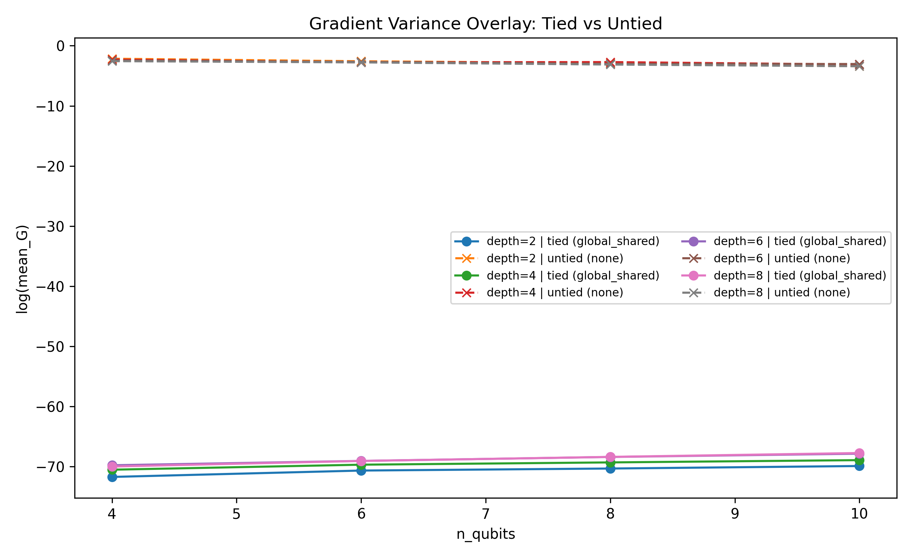

# ONE_PAGER: Tying vs Untied Gradient Variance

## Objective
This note compares tied (`global_shared`) and untied (`none`) parameterizations under the same IQP gradient-variance contract. The target is to isolate whether tying changes the direction of scaling in `log(mean_G)` as `n_qubits` grows. All conclusions are constrained to the matched finite grid and existing run outputs.

## Frozen Contract
- Circuit family: `iqp`
- Observable: `Z0`
- Gradient estimator: `param_shift`
- Backend mode: `statevector_exact`
- Shots: `null`
- Scalar definition: `G^(t) = (1/P) * sum_i (g_i^(t))^2`

## Matched-Grid Scope
- Tied run source: `results/grad_variance_full_sweep_001/`
- Untied run source: `results/grad_variance_untied_sweep_001/`
- Compared grid: `n_qubits=[4,6,8,10]`, `depth=[2,4,6,8]`

## Key Fit Table
| depth | slope_tied | r2_tied | slope_untied | r2_untied |
|---:|---:|---:|---:|---:|
| 2 | 0.289342 | 0.9248 | -0.203099 | 0.9896 |
| 4 | 0.257941 | 0.9558 | -0.121355 | 0.8571 |
| 6 | 0.322061 | 0.9961 | -0.104491 | 0.9165 |
| 8 | 0.370939 | 0.9920 | -0.145062 | 0.9904 |

## Overlay Figure


## How To Reproduce
```bash
ls results/grad_variance_full_sweep_001 results/grad_variance_untied_sweep_001
python scripts/make_grad_variance_overlay.py
ls artifacts/03_vqa_gradients_iqp/figures/overlay_log_meanG_vs_n_tied_vs_untied_300dpi.png
```

## Where Outputs Go
- Source runs: `results/grad_variance_full_sweep_001/` and `results/grad_variance_untied_sweep_001/`
- Generated figure: `artifacts/03_vqa_gradients_iqp/figures/overlay_log_meanG_vs_n_tied_vs_untied_300dpi.png`
- Summary doc: `artifacts/03_vqa_gradients_iqp/ONE_PAGER.md`

## What To Look At
- The overlay figure: check slope direction by depth for tied vs untied curves.
- The fit table: verify sign flip (`slope_tied > 0`, `slope_untied < 0`) across all matched depths.
- Caveats: confirm interpretation stays finite-regime and parameter-tying aware.

## Conclusions
- Across all matched depths, tied slopes are positive while untied slopes are negative for `log(mean_G)` vs `n_qubits`.
- The direction flip is consistent over the full matched grid, not a single-cell effect.
- Under this fixed contract, parameter tying is a primary factor in observed scaling direction.

## Caveats
- Parameter tying is a confound: `global_shared` changes optimization geometry and effective hypothesis class.
- This is a finite regime (`n<=10`, `depth<=8`), so no asymptotic claim is implied.
- Results are contract-specific (`iqp`, `Z0`, exact-statevector); transfer to other settings is not guaranteed.

## Next Steps
- Add a middle condition (for example `layer_shared`) to map trend transitions.
- Repeat with `sumZ` to test observable sensitivity.
- Run shot-based variants to measure whether noise changes the slope contrast.
